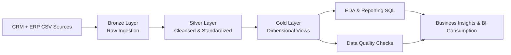

# SQL Data Warehouse Project

A production-style SQL Server data warehouse project built with a **Medallion architecture (Bronze → Silver → Gold)** and an extended **Exploratory Data Analysis (EDA)** layer for business insights.

## Project Objectives

- Integrate CRM and ERP source datasets into a centralized warehouse.
- Apply structured cleansing and transformation logic to improve data quality.
- Publish analytics-ready dimensional models for BI and reporting.
- Validate data reliability with SQL-based quality checks.
- Provide reusable EDA and reporting SQL assets for stakeholder analysis.

## Architecture Summary

### Overall Architecture Diagram (Start to Finish)



### Bronze (Raw Ingestion)

- Ingests source CSV files with minimal transformation.
- Uses `BULK INSERT` inside `bronze.load_bronze`.
- Preserves source-level traceability.

### Silver (Cleaned & Standardized)

- Applies cleansing, normalization, deduplication, and enrichment.
- Standardizes categorical values and fixes invalid/null records.
- Adds warehouse metadata such as `dwh_create_date`.

### Gold (Business Model)

- Exposes star-schema analytical views:
  - `gold.dim_customers`
  - `gold.dim_products`
  - `gold.fact_sales`
- Supports downstream reporting and dashboarding.

### EDA and Reporting Layer

- Includes progressive SQL analysis scripts for profiling, trends, ranking, segmentation, and performance evaluation.
- Adds reusable report views:
  - `gold.report_customers`
  - `gold.report_products`

## End-to-End Workflow

Run scripts in this order:

1. `scripts/init_database.sql`
2. `scripts/bronze/ddl_bronze.sql`
3. `scripts/bronze/load_data_bronze.sql` (`EXEC bronze.load_bronze;`)
4. `scripts/silver/ddl_silver.sql`
5. `scripts/silver/load_data_silver_sql` (`EXEC silver.load_silver;`)
6. `scripts/gold/ddl_gold.sql`
7. Optional EDA/reporting scripts in `scripts/EDA/`
8. Validation scripts:
   - `test/quality_checks_silver.sql`
   - `test/quality_checks_gold.sql`

## EDA Script Coverage

The EDA suite under `scripts/EDA/` includes:

- Database and schema exploration
- Dimension and date-range exploration
- KPI and magnitude analysis
- Ranking and trend analysis
- Cumulative and performance analysis
- Customer/product segmentation
- Part-to-whole contribution analysis
- Business report view creation

## Repository Structure

```text
sql-data-warehouse-project/
├── datasets/                    # Source data files (not versioned in full)
├── docs/
│   ├── data_catalog.md          # Gold-layer data catalog
│   ├── data_model.png
│   ├── data_flow_diagram1.drawio.png
│   ├── data_warehouse_architecture.drawio (3).png
│   └── eda_architecture_block_diagram.md
├── scripts/
│   ├── init_database.sql
│   ├── bronze/
│   │   ├── ddl_bronze.sql
│   │   └── load_data_bronze.sql
│   ├── silver/
│   │   ├── ddl_silver.sql
│   │   └── load_data_silver_sql
│   ├── gold/
│   │   └── ddl_gold.sql
│   └── EDA/
│       ├── 01_database_exploration.sql
│       ├── 02_dimension_exploration.sql
│       ├── 03_date_range_exploration.sql
│       ├── 04_measures_exploration.sql
│       ├── 05_magnitude_analysis.sql
│       ├── 06_ranking_analysis.sql
│       ├── 07_change_over_time_analysis.sql
│       ├── 08_cumulative_analysis.sql
│       ├── 09_performance_analysis.sql
│       ├── 10_data_segmentation.sql
│       ├── 11_part_to_whole_analysis.sql
│       ├── 12_report_customers.sql
│       └── 13_report_products.sql
├── test/
│   ├── quality_checks_silver.sql
│   └── quality_checks_gold.sql
└── README.md
```

## Data Quality Validation

Validation scripts cover:

- Duplicate/null key detection in core entities
- Whitespace and categorical standardization checks
- Date validity and chronological consistency checks
- Sales consistency checks (`sales_amount`, `quantity`, `price`)
- Fact-to-dimension relationship integrity checks

## Usage Notes

- `init_database.sql` drops and recreates `DataWarehouse`; use only in safe environments.
- Update local file paths in Bronze `BULK INSERT` statements before execution.
- Execute the workflow sequentially to ensure dependency-safe loading.

## Documentation

- Gold data dictionary: `docs/data_catalog.md`
- EDA architecture block diagram: `docs/eda_architecture_block_diagram.md`

## Project Conclusion

This project delivers a complete SQL Server data warehouse pipeline from raw source ingestion to analytics-ready outputs.  
Using the Bronze → Silver → Gold medallion pattern, it establishes reliable data foundations, structured transformations, and business-focused models for reporting.  
With integrated quality checks and reusable EDA/reporting assets, the repository is ready for ongoing analysis, dashboard development, and future data product expansion.
