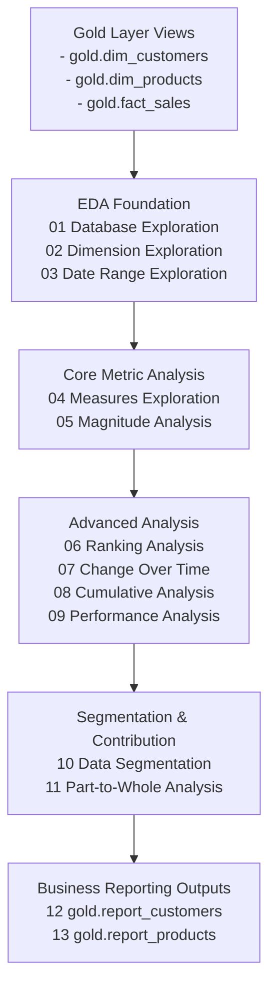

# EDA Architecture Block Diagram

The diagram below shows how the EDA assets are organized on top of the Gold analytical layer.

## Reading the Diagram

- **Gold Layer Views** are the analytical base for all EDA queries.
- **Foundation scripts** profile structure and temporal coverage.
- **Core and advanced analysis scripts** generate KPI, trend, and comparative insights.
- **Final reporting scripts** materialize reusable views for business consumption.
